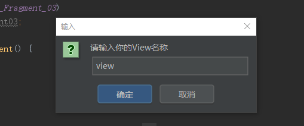

# RemolveButterknifeKnifePlus
## 介绍
首先介绍下RemolveButterknifeKnife(https://github.com/u3shadow/RemoveButterKnife)，这是个能够快速去除butterknife的插件。但是这个插件现在用起来感觉有些地方体验不是很好。
1. 生成的findviewbyId代码有强转冗余代码，这在新版的androidstudio中看起来很别扭。 。 
2. 在Fragment中生成的findviewById代码没有生成的view，结果如下 。 在这种情况下如果有大量的view或者fragment生成这样的代码的话都需要手动添加view，这将是个很繁琐的工作量。
为了解决这问题，RemolveButterknifeKnifePlus应运而生。
针对这上面两种的情形RemolveButterknifeKnifePlus插件生成的代码是这样的逻辑：当我们在Activity中运用插件的时候生成的代码不会有强转类型的冗余代码，在fragment中应运插件的时候会弹出个输入框 。
 从android代码可以知道我们fragment的view名称是view，我们想生成的代码是view.findviewbyId.所以在输入框中输入view点击确定就可以生成想要的代码。
## 总结
RemolveButterknifeKnifePlus的实现原理跟RemolveButterknifeKnife是一样的，只是在其基础上增加了些代码让我们的操作更加简洁。
